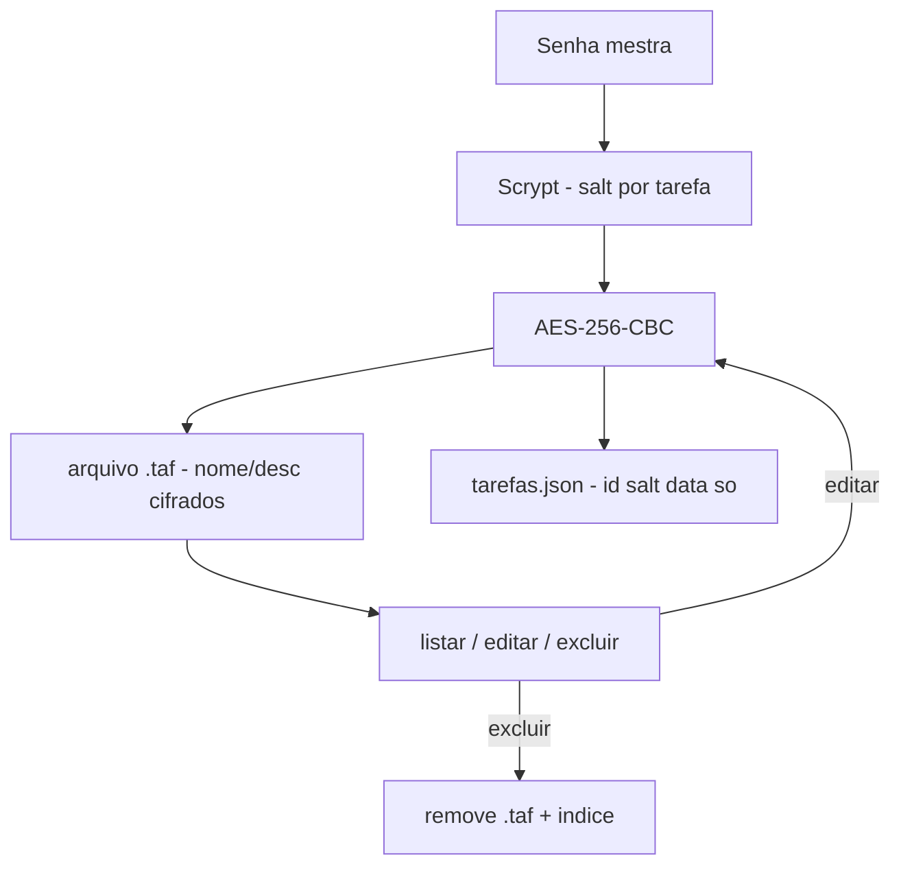

# 🔐 Encrypted-Task-Manager — Tarefas Cifradas em Disco
<p align="center">
  
  <a href="https://github.com/panda12332145/Encrypted-Task-Manager/commits/main"></a>
  <a href="https://github.com/panda12332145/Encrypted-Task-Manager"></a>
  
</p>
---
## 🔖 Resumo

Gerenciador de tarefas em **TUI portátil** onde **tudo é gravado cifrado**: nome e descrição de cada tarefa são salvos em arquivos `.taf` com **AES-256-CBC**, usando chaves derivadas da **senha mestra** via **Scrypt** (n=2¹⁴). O índice guarda só metadados (id, salt, data) — nunca conteúdo em claro. Inclui criar, listar, **editar** e excluir.

### ✨ Funcionalidades Principais

- ✅ Criação, listagem, **edição** e exclusão de tarefas
- ✅ AES-256-CBC por tarefa com salt próprio (Scrypt 2¹⁴)
- ✅ Índice `tarefas.json` sem nenhum dado sensível em claro
- ✅ Escrita atômica do índice (tmp + replace) — nunca corrompe
- ✅ TUI 100% portátil: só `input`/`print` (sem root, sem `keyboard`)
- ✅ Diretório configurável por `TAREFAS_DIR` (testes e máquinas sem ~/Documents)

## 📽 Demonstração

```text
$ python main.py
🔑 Senha mestra: ****
==================================
   🗂️  Gerenciador de Tarefas (criptografado)
==================================
  1. Criar Nova Tarefa
  2. Ver Tarefas
  3. Editar Tarefa
  4. Excluir Tarefa
  5. Sair
Escolha [1-5]: _
```

## ⚙️ Explicação das Partes Importantes

### Derivação de chave (`src/storage.py`)

```python
def derive_key(password, salt):
    kdf = Scrypt(salt=salt, length=32, n=2**14, r=8, p=1)
    return kdf.derive(password.encode())
```

> Scrypt é resistente a GPU/ASIC: a senha mestra custa caro para ser atacada mesmo com disco apreendido.

### Cifra por tarefa (`src/tasks.py`)

```python
salt = os.urandom(16)                 # único por tarefa
key = derive_key(password, salt)
enc_name = encrypt(key, name)          # nome cifrado
# descrição -> arquivo .taf cifrado; salt vai só no índice
```

> Cada tarefa tem salt próprio — comprometer uma não derruba as outras.

### Edição com re-cifragem (`edit_task_values`)

```python
# decifra com a chave da MESMA tarefa (mesmo salt),
# aplica alterações e re-cifra; id e data de criação preservados
```

> A função **Editar** do monolito original foi restaurada — o refactor para `src/` tinha perdido.

### Índice atômico (`save_index`)

```python
tmp = path + ".tmp"
json.dump(data, open(tmp, "w"))
os.replace(tmp, path)   # atômico no mesmo filesystem
```

> Nunca existe meio-índice escrito — queda de energia não corrompe o arquivo.

## 🔄 Fluxo de Trabalho / Arquitetura



## 📂 Estrutura do Projeto

```plaintext
Encrypted-Task-Manager/
├── main.py                 # Entrada interativa (getpass)
├── src/
│   ├── storage.py          # Scrypt + AES-CBC + índice atômico
│   ├── tasks.py            # Regras: criar/listar/editar/excluir
│   └── tui.py              # Menu portátil (sem dependências)
├── tests/test_tasks.py     # 5 testes (CRUD, senha errada, disco limpo)
├── requirements.txt
└── README.md
```

## 🛠️ Tecnologias

| Ferramenta | Uso |
|---|---|
| **Python 3** | Linguagem |
| **cryptography** | AES-256-CBC + Scrypt |
| **TUI** | Menu interativo portátil |

## ▶️ Instalação

```bash
git clone https://github.com/panda12332145/Encrypted-Task-Manager.git
cd Encrypted-Task-Manager
pip install -r requirements.txt

# opcional: onde os dados ficam
export TAREFAS_DIR="$HOME/Documents/Tarefas"   # padrão
```

## 🚀 Execução

```bash
python main.py

# testes:
python tests/test_tasks.py
```

## 🧪 Testes

5 testes: CRUD completo, senha errada levanta `WrongPassword`, conteúdo **ausente** do disco em claro, validação de limites e resiliência a índice corrompido.

## ⚠️ Limitações

- Sem recuperação de senha (esqueceu = perdeu, por design)
- Uso concorrente de duas instâncias no mesmo diretório não é suportado
- TUI simples (sem busca/filtros ainda)

## 🚀 Roadmap

- [ ] Busca e filtro de tarefas
- [ ] Export/import cifrado
- [ ] Marcar conclusão pelo menu (já suportado no core)
- [ ] Senha mestra com verificação (hash de verificação)

## 📄 Licença

Todos os direitos reservados ao autor.

---

## 👾 Autor

<p align="center">
  
</p>

<p align="center">Feito por <strong>Panda12332145</strong> 👋🏽</p>

---

## 🧑‍💻 Sobre Mim

Sou apaixonado por **Física Teórica, Cibersegurança e Desenvolvimento de Sistemas**. Tenho grande interesse em programação de baixo nível, engenharia reversa, automação, sistemas Windows, criptografia e segurança ofensiva. Também gosto bastante de música, filosofia e computação avançada.

---

## 🌐 Redes

* **Site:** [https://panda-h0me.netlify.app/](https://panda-h0me.netlify.app/)
* **YouTube:** [https://www.youtube.com/@X86BinaryGhost](https://www.youtube.com/@X86BinaryGhost)
* **Instagram:** [https://www.instagram.com/01pandal10/](https://www.instagram.com/01pandal10/)
* **GitHub:** [https://github.com/panda12332145](https://github.com/panda12332145)
* **LinkedIn:** [linkedin.com/in/athos-da-boanergis](https://www.linkedin.com/in/athos-d%C3%A3-boanergis-5585a4288/)

---

## 🚀 Áreas de Interesse

* **Cibersegurança Avançada** 🔒
* **Hacking & Engenharia Reversa** 💻
* **Computação de Baixo Nível** 🖥️
* **Matemática e Física Teórica** 📐⚛️
* **Desenvolvimento de Ferramentas de Segurança** 🛠️

_"Conhecimento é poder, e domínio técnico vem da compreensão profunda dos sistemas."_

---

## 📞 Contato & Suporte

Para colaborações, dúvidas ou sugestões:

📧 **E-mail:** [athos.cybersec@gmail.com](mailto:athos.cybersec@gmail.com)

🐛 **Reportar Bug:** [Abrir Issue](https://github.com/panda12332145/Encrypted-Task-Manager/issues)

💡 **Sugerir Melhoria:** [Discussions](https://github.com/panda12332145/Encrypted-Task-Manager/discussions)
